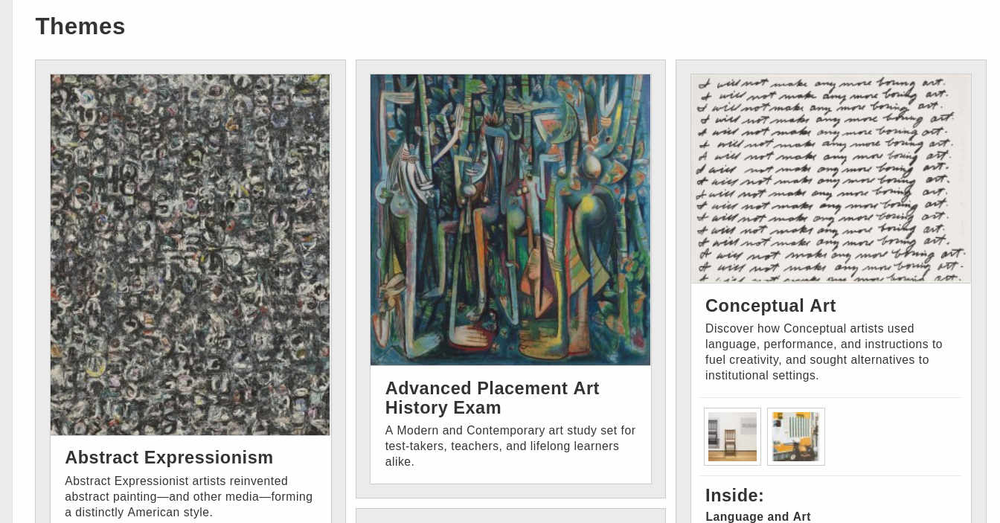

# 🎨 Sanat Akımları

📎 art 📎 paint

Tüm sanat alanlarında olduğu gibi çizim sanatında da her dönem belirli akımlar başlamıştır. Her akım farklı bir temayı baz almaktadır. Bu kaynakta bazı temaları ayrı ayrı gruplayarak anlatılmış. Ayırt etmek isteyenlerin okumasını tavsiye ederim.

<https://www.moma.org/learn/moma_learning/themes/>

Birçok farklı sanat eserine gruplanmış şekilde buradan ulaşabilirsiniz:

<https://artsandculture.google.com/category/art-movement>
