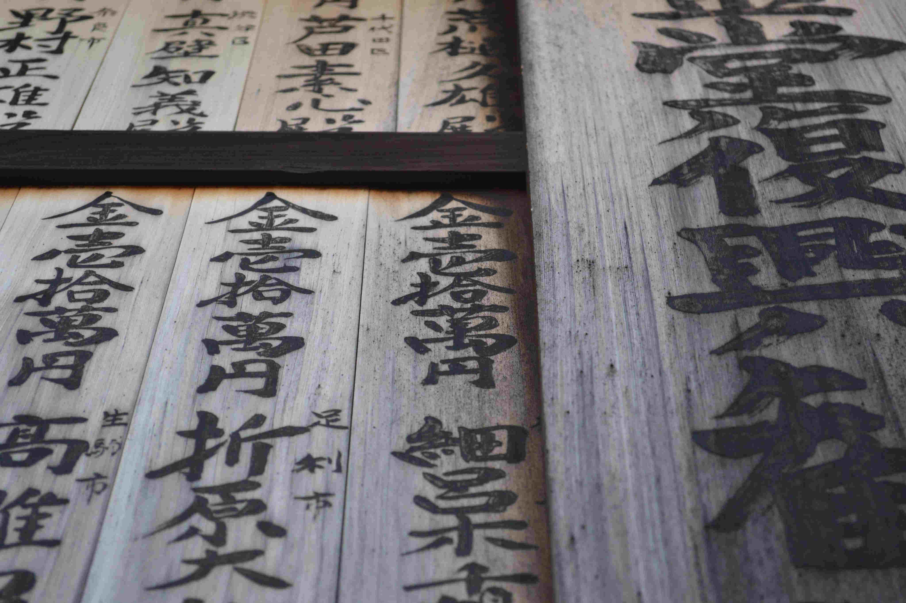

# 🗣️ Dillerin ilginç yapıları

Farklı kültürler, farklı yaşam şekilleri doğuruyor. Bu yazıda, farklı dillerdeki çeşitliliklerden bahsedeceğim.

## 🗣️ Çin ve Çince

`Çince`'yi ele alalım:

- `Çin`'de birçok farklı türemiş dil mevcuttur. Ülke resmi olarak `Mandarin` isimli dili kullanmaktadır. `Mandarin` `Çin`'de en fazla kullanılan dildir. `Cantonese` ve `Wu` dilleri diğer en çok kullanılan diller arasındadır.

- Sadece `Çince` denildiğinde muhtemelen `Mandarin` kastediliyordur.

- `Mandarin`, `Cantonese` arasında farklar: bazı karakterler, bazı gramer yapıları, bazı tonlamalar, bazı kelime hazinesi. Dolayısı ile, `Mandarin` metni okunduğunda, sadece `Cantonese` bilen biri bu cümleleri anlayamıyor.

- `Çin`'de yüzlerce `dialect` vardır.

- `Classical Chinese (⬄ Literary Chinese)` hala kullanılan ve İsa zamanına dayanan bir tarihi vardır.

## 🗣️ Kore ve Japonya

`Kore` ve `Japonya`'da, `Çin`'deki gibi bir durum söz konusu değildir, çünkü tek bir dil var fakat çok çok ufak bölgesel farklılıklar görülebilir.

## 🗣️ Traditional vs Simplified Chinese

`Çince` zor dil olduğundan her karakter daha basit bir görüntü haline getirilip, ortaya daha basit okunabilen karakterler yaratılmıştır. Bu yeni sisteme `Simplified Chinese` ismi verilmiştir. `Simplified Chinese`'de her karakter değişmemiştir.

`Japonca` da benzer durum yok, çünkü `Japonca` `Simplified Chinese`'e göre dahi daha kolay anlaşılır bir görüntüsü var.

## 🗣️ Yazı sistemi (⬄ writing system ⬄ script)

`yazı sistemi`; bir dilin yazı stilidir. örnek: `Arapça` `script`'ini ele alalım. Bu `script`'in baz alındığı birçok dil vardır: `Iraqi`, `Lebanese`, `Egyptian`... `Arapça` baz alınan dillerin %100 `Arapça` yazı stili kurallarına uymayacağı zaten ortadadır. Zaten tamamen aynı olsalar, o zaman çatallanma meydana gelmezdi.

Bazı diller birden fazla yazım sistemini desteklemektedir. Örnek: `Korece (Korean)`, `Japonca (Japanese)`. Bu dillerde aynı cümleler farklı yazı sistemi ile yazılabilmektedir.

Daha spesifik örnek verirsek: `Japonca`'da aşağıdaki yazım sistemleri vardır:

- `Hiragana`: `Japonca` kökenli kelimeleri yazmak için kullanılır.
- `Katakana`: `Yabancı` kökenli sözcüklerin yazmak için kullanılır. Örneğin "`otel`" kelimesinin karşılığı sadece `Katakana`'da vardır. `Hiragana`'da böyle bir kelime yoktur.
- `Kanji`: `Çince`'den geçen kelimeler için kullanılır. (`Kanji` kelime anlamı: `Çin` Harfi (`Çince` yazı karakterlerine `Japonca`'da verilen isim)).

`Japonca`'da aynı cümle içerisinde dahi birden fazla yazım stili olabilir.

## 🗣️ Romanji

`Romanji`'de, `Japon` yazı sistemindeki her karaktere ve heceye karşılık gelen latin karakterleri vardır. `Japonca`'da yazılacak cümle, aynı karakterlere denk gelen latin karakterleri ile yazılır. `Romanji`'ninde kendi içinde türevleri vardır.

## 🗣️ Arapça

Biraz terminolojik bilgi üzerinden açıklayacağım 😀

`Klasik Arapça (⬄ Classical Arabic = Quranic Ara`bic), 7 ve 19 uncu yüzyıllar arası kullanılan `Arapça`'dır. Şu anda daha çok dinsel eğitimlerde ve ibadetlerde kullanılmaktadır.

`Old Arabic (⬄ eski Arapça)`, klasik `Arapça`'dan önce kullanılması ile ölen bir dildir.

`Modern Standard Arabic (⬄ MSA ⬄ Standard Arabic ⬄ Modern Written Arabic ⬄ MWA ⬄ Fasih Arapça)` birçok ülke tarafından resmen tanınan bir `Arapça` çeşididir. Günümüz sistemlerine uygun şekilde tasarlanmaktadır. `Klasik Arapça` temelli bir dildir. `Arapça`da bu dile `El-Arabiyye el-fusha` denir.

`Ammi Arapçası (⬄ Ammiya Arabic)` halkın kendi içinde konuştuğu `Arapça`'dır ve her `Arap` ülkesine göre değişiklikler gösterir. Halk `Ammiya` dilini konuşurken, yazılı mecralarda ve medyada `MSA` kullanılır.

"`Ammiya`", `Arapça` bir kelimedir. `İngilizce`'ye ve `Türkçe`'ye direk okunuşu ile çevrilmiştir. `Ammiya`'nın kelime anlamı: çoğunluğun dili.

`Ammi Arapça`'sına örnekler:

- `Eastern Arabic` - East bölgelerinde kullanılan `Arapça`.
- `Mashriqi Arabic (Mashriqi Ammiya)` - `Mashriqi` bölgelerinde kullanılan Arapça.
- `Lebanese Arabic` - Sadece `Lübnan`'da kullanılan `Arapça`.
- `Syrian Arabic` - Sadece `Suriye`'de kullanılan `Arapça`.

`Literary Arabic (⬄ Edebi Arapça)` terimi biraz genel bir terim olduğundan kesin referans ettiği bir karşılığı yoktur. Herkes farklı anlamda kullanabilir.

Not: Tüm `Arapça` dillerinin alfabeleri aynıdır.

## 🗣️ Çin ve Arapça'da sayılar

`Arapça`da sayıların görünümü farklı fakat sistem olarak "`Arap rakamları (0-9)`" ile aynı. yani her basamak bir karaktere denk geliyor.

`Çince` temelli dillerde de sayılar bölgeden bölgeye farklılıklar gösterir.

`Çince`'de ise yazım sistemi de farklı. örnek üzerinden gidersek; `Mandarin Çincesi`nde her karakter bir sayıyı ifade etmiyor. örnek:

- `四十二` `42` iken
- `九十` ise `90`'ı temsil ediyor.

görüldüğü gibi sayı daha büyük olmasına rağmen daha az karakterle temsil ediliyor.

Özellikle yazılımlarda programatik olarak `sıralama` istendiğinde çok zor durumlarla karşılaşılmaktadır.

## 🗣️ Bir sayıyı metne çevirme veya metinden sayıya çevirme

Bu işi bilgisayara yaptırmak sanıldığında zor.

- `105` --> yüz beş

- `1208` --> bin iki yüz sekiz

Bu işlemler `i18n` gibi kütüphanelerin görevi değildir. bu sebeple ekstra kütüphane kullanmak gerekiyor. Günümüz itibari ile hala bu işi yapan düzgün ve multi-language kütüphane mevcut değil.

Bunu yapan kütüphaneleri genelde "`number to word`" terimleri ile arama yapmak gerekiyor. Genelde her dil için ayrı kütüphane kullanmak gerekiyor. Bazı dillerde yine kompleks durumlar söz konusu olabiliyor. Örneğin; `Fransızca`'da sayıların bazıları yazılırken veya okunurken, `Türkçe` ve `İngilizce`'deki gibi direk sayı değerleri ile ifade edilmeyip, başka sayıların toplamı olarak ifade edilmektedir. Örnek: "`90`", "`2 40 10`" olarak yazılıyor ve söyleniyor (`2*40+10` olduğu için).

## 🗣️ Sayı ve sayma sistemleri

Bazı dillerde sayıları listelemek yerine bir objeyi saymak için sayı kullandığımızda, saydığımız obje farklı bir kelimeye veya kelimelere bürünmektedirler. Bu konu için `İrlandaca (Irish)` örnek verilebilir. `İrlandaca`'da:

- bir sayıyı bir şeyi saymak için kullanıyor veya telefon numarası verirken kullanıyor isek, sayıların önüne farklı bir kelime gelmektedir.
- "`Bir kalem`" yerine "`tek kalem`" gibi ibareler şarttır.
- "`üç kalem`" gibi ibarelerde, "`kalem`" kelimesi bazen değişebilmektedir ve bu sadece bazı sayılar için olmaktadır (değiştiği zaman her sayıda değişmemektedir.) 😀
- Bu durumlardan çok daha fazlası mevcut. Örnek: <https://www.bitesize.irish/blog/counting/>
- Başka dillerde farklı kompleks durumlar olabilir.

## 🗣️ Daha fazlası

Çok daha fazlasını merak edenler, özellikle yazılımcıların okuması için tuttuğum notları buradan okuyabilir:

<https://github.com/yusuf-daglioglu/tutorials/blob/master/tutorials/unicode_and_multi_language_apps.md>

  

<b>Lisans:</b>

Bu makale <a href="https://creativecommons.org/licenses/by-sa/4.0/" target="_blank" rel="license noopener">
<b>Creative Commons Attribution-ShareAlike 4.0 International (CC BY-SA 4.0)</b>
</a> lisansı ile lisanslanmıştır.

<b>License:</b>

This article is licensed under the <a href="https://creativecommons.org/licenses/by-sa/4.0/" target="_blank" rel="license noopener">
<b>Creative Commons Attribution-ShareAlike 4.0 International (CC BY-SA 4.0)</b>
</a> license.

  