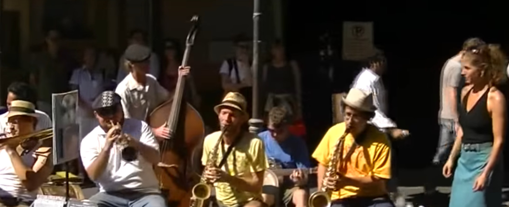
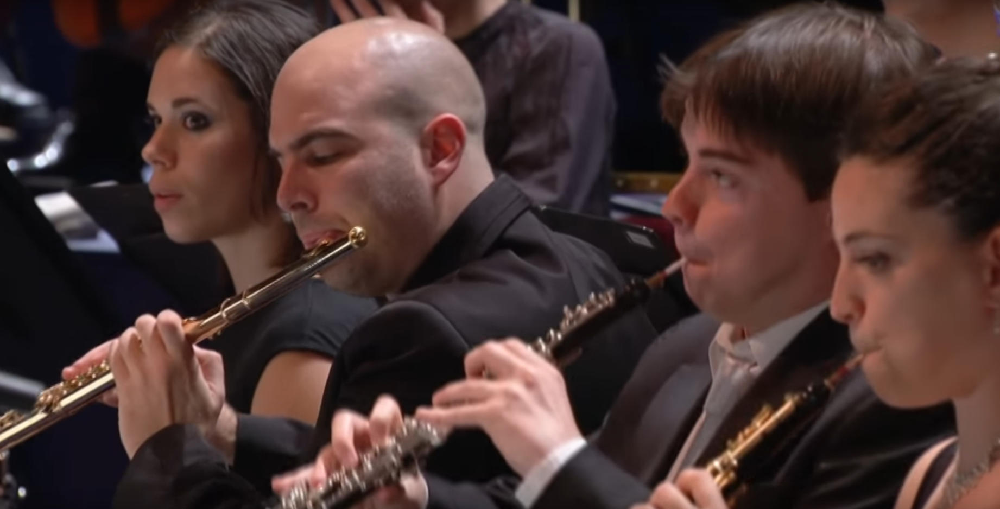
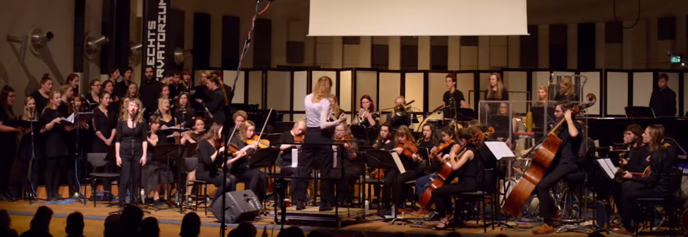

---
hide:
  - toc
---

# 🎨 Notable live performances and covers

📎 art 📎 music

I spent a lot of time to archive all musics that I listen... Each song is performed by many artists but I choose my favorite ones. Here are some:

## 🎶 Charleston of James Johnson

performed by "Smoking Time Jazz Club"

<https://www.youtube.com/watch?v=msvOqvBJLBw>

## 🎶 9th Symphony of Beethoven

performed by: West Eastern Divan Orchestra (year 2012)

<https://www.youtube.com/watch?v=GWe2-0SGmRU>

## 🎶 Paranoid Android of Radiohead

performed by: Utrecht Conservatory

<https://www.youtube.com/watch?v=dtybOwm6UYE>

## 🎶 Crave of Jell Roll Monton

performed by: Ennio Morricone

<https://www.youtube.com/watch?v=IBtAPiWibqE>

## 🎶 Summertime of George Gershwin

performed by: New York Choral Artists

<https://www.youtube.com/watch?v=y4NWqNg-yUk>
