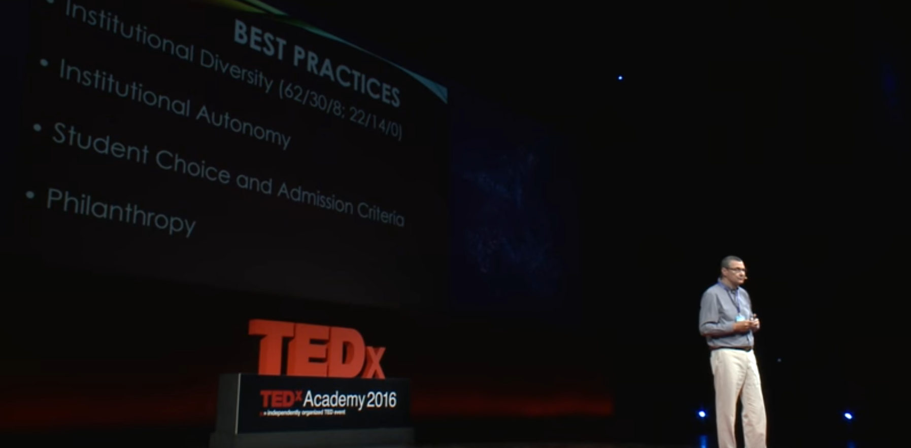

---
hide:
  - toc
---

# 🏛️ Aυτονομία Πανεπιστημίων

Πρέπει να πάρουμε μάθημα από την ιστορία και από άλλα παραδείγματα. Σήμερα, τα πανεπιστήμια σε πολλές γεωγραφίες δεν είναι αυτόνομα.

Πριν από 6 χρόνια, το 2016, ο `Δρ. Ο David G. Horner` (Πρόεδρος του Αμερικανικού Κολλεγίου Ελλάδος) έκανε μία ομιλία στο `TEDx` και είχε αναφέρει για την αυτονομία των πανεπιστημίων.

Την ημερομηνία που έκανε την ομιλία του, αν η Ελλάδα έκανε βήμα προς την πανεπιστημιακή αυτονομία, μέχρι το 2030, τα 3 πανεπιστήμια θα έμπαιναν στη λίστα ως καλύτερα πανεπιστήμια του κόσμου.

## Τα σημαντικότερα στοιχεία που ανέφερε είναι

- θεσμική πολυμορφία
- θεσμική αυτονομία
- Κριτήρια επιλογής και εισαγωγής φοιτητών
- Φιλανθρωπική οργάνωση

Σας συνιστώ να ακούσετε από David Horner ποιες είναι αυτές οι ουσίες:

<https://www.youtube.com/watch?v=2OlhCITl1J4>
