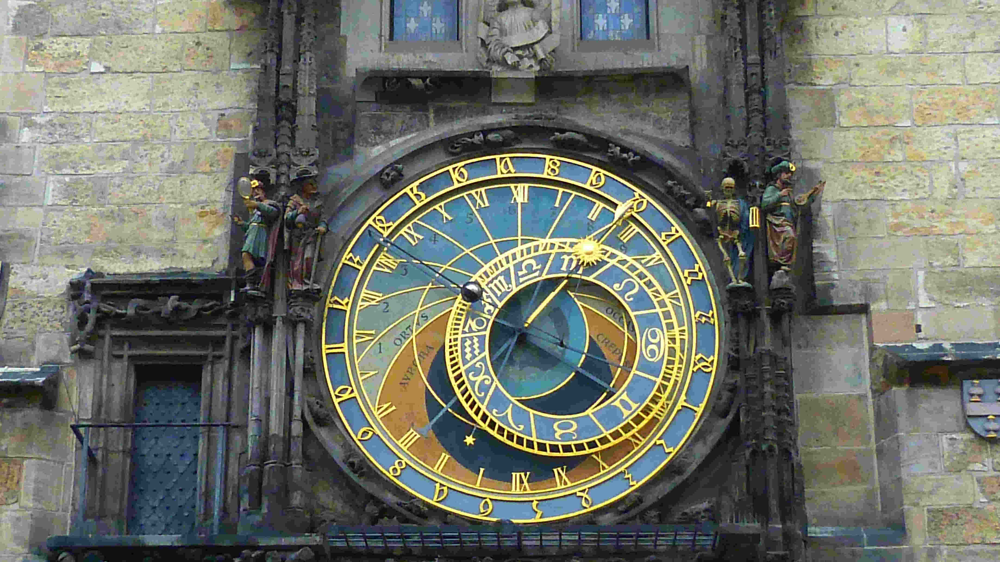

# ⏰ Saat kaç?

Zaman soyut bir kavram. Bu sebeple özellikle dijital dünyada zamanı yönetmek gerçekten zor olabiliyor.

Bu yazıda,

- `2020 Temmuz 13 13:30 UTC+3:00`

tarihinin ne anlam ifade ettiği ile ilgileneceğiz. Fakat her şeyden önce zamanın ne olduğunu anlamamız gerekli.

## ⏰ "1 Saniye" nedir ve nasıl ölçülür?

Zamanın en ufak birimi "`saniye`". Demek ki `saniye`yi anlarsak zamanı kavramak için ilk adımımızı atmış oluruz.

1 saniyeyi ölçebilirsek;

- 30 saniye,
- 90 saniye,
- 3 yıl,
- 24 gün 46 saniye

gibi süreleri de basit bir çarpma işlemi ile ölçebiliriz. Demek ki her şey `1 saniye`yi anlamayı gerektiriyor. Peki `1 saniye`yi, dünyanın her tarafındaki bilim adamları ve mühendisler nasıl ölçebiliyor. Diyelim ki bir adada tek başınızasınız. `1 saniye`'yi nasıl ölçebilirsiniz? Peki ya uzaylılar ile temasa geçersek, onlarla zaman konusunda nasıl anlaşacağız?

## ⏰ IS sistemine göre "saniye"

`Saniye`, `IS (Uluslararası Birimler Sistemi)` tanımına göre şudur:

> The second is defined by taking the fixed numerical value of the cesium frequency ∆νCs, the unperturbed ground-state hyperfine transition frequency of the cesium-133 atom, to be 9,192,631,770 when expressed in the unit Hz, which is equal to s−1.

Biraz kompleks 😀 Gelin bunu basitleştirelim:

> Sezyum-133 isimli bir atom var. Bu atomu bilimin tanımlayabildiği en soğuk ortama koyuyoruz. Bu sırada bu atomun yaptığı spesifik bir hareketin periyotlarını sayıyoruz. Hareketler 9 milyar sayısına ulaştığında, 1 saniye geçmiş olarak kabul ediyoruz.

Yukarıdaki ifadelerim kısmen yanlış (⚠️) ama ölçümün hangi konseptte yapıldığını anlamış olmalısınız.

Burada unutmayalım ki bu tanım `IS` sistemine göre. Dünyada farklı otoriteler farklı tanımlar yapabilir. Dolayısı ile hangi sistemin "`zaman`" kavramlarını kullandığınıza dikkat etmelisiniz.

## ⏰ Atom saati (atomic clock)

Atom seviyelerinde hesaplamalar yaparak çalışan fiziksel saatlerdir. Birçok çeşit başarılı atom saati yapılmıştır. Atom saatlerinde sapmalar yazılımlarda değerlendirilmeyecek kadar küçüktür (örneğin; 3 milyon yılda, 1 saniye sapma oluyor).

Atom saati, `IS` sistemindeki saniyeyi en iyi implemente eden saat olarak düşünebilirsiniz.

## ⏰ UTC vs GMT

Bunlar iki farklı zaman sistemidir. Hangi zaman sistemini kullanıyorsak o zaman diliminin kısaltmasını saatin sağ tarafına yazmamız şarttır. Eğer yazmıyorsak hata yapıyoruz anlamına gelir. Çünkü; `UTC`'de saat `13:00` iken, aynı anda `GMT`'de saat `13:00` olmayabiliyor.

## ⏰ UTC nedir?

`IS` sistemindeki saniyeyi baz alarak çalışan zaman sistemidir.

## ⏰ GMT nedir?

`GMT`'de 1 yıl, dünyanın güneş etrafında dönmesine eşit. Burada ince bir nokta var: Evrende her şey bu kadar milimetrik yürümüyor. Yani dünya her yıl tam olarak aynı süre zarfında güneşin etrafında turlamıyor. Her yıl bu sürede farklılıklar olabiliyor.

İşte bu farklılıkları `GMT` önemsemiyor ve 1 yılı güneşin etrafındaki dönüşüne göre tamamlıyor. Burada `GMT`'ye göre "1 saniye" kavramının, `IS`'teki gibi pek sabit olmadığını fark edeceksiniz.

## ⏰ Leap Second

Dünya güneşin etrafında her yıl döndükçe, `UTC` ve `GMT` arasında bir zaman farkı meydana geliyor. örneğin; `GMT` `13:00` iken, `UTC` `13:02` olabiliyor. Bu fark git gide açılıyor. Bu farkın açılmasını önlemek için bilim adamları, uluslararası otoriteler üzerinden karar alarak belli günlerde `UTC`'yi 1 arttırıyor.

Örneğin; `31 Aralık 2016 gecesi`, `UTC` 1 saniye arttırıldı. Bu karar uyum sağlayamayan tüm sistemler (yazılımlar) hata verip durdu. İşte bu sebeple, bu detayları bilen mühendisler çalıştırmaya gayret etmelisiniz.

2020 yılına dek toplamda 25'in üstünde artık saniye uygulandı.

2016'da artık saniyenin uygulandığı gece kolunuzdaki saate bakarsanız, her saniye ekranda şunları görecektiniz:

(Aşağıdaki her satır 1 saniye boyunca ekranda gözükeni gösteriyor)

- 23:59:57
- 23:59:58
- 23:59:59
- 23:59:59  `--> Burası 2 kere gözüktü. Yani 2 saniye sürdü.`
- 00:00:00
- 00:00:01
- 00:00:02

Kol saatiniz bu şekilde gösteriyor olsa da her cihaz aynı gösterimi uygulamayabiliyor. Bazı cihazlar `00:00`'ı 2 kere göstermeyi tercih edebiliyor. `RFC-3339` standartlarına göre `23:59:60` gösterilmesi uygun görülüyor.

## ⏰ Artık saniyeye uymayan sistemlerdeki sorunlar

İnternette `leap second impact` yazarsanız, `artık saniye`ye uymayan sistemlerden ne gibi hatalarla karşılaşıldığını okuyabilirsiniz.

## ⏰ Artık yıl (leap year)

Hepimizin bildiği `29 Şubat` meselesidir bu konu. Fakat `29 şubat`, her 4 senede 1 kere uygulanmıyor. Bazı istisnalar var.

Dünya güneş etrafında `365,24` küsür günde dönüyor. `miladi takvim`e göre; her yıl 365 kabul edilmiştir. 4 yılda bir kere `29 Şubat` kullanılmaktadır. `29 Şubat` olan yıla "`artık yıl`" denir. `artık yıl`ın, 4 senede 1 kere olmasını belirleyen iki özel kural daha var:

- `kural-1`

    > Eğer yıl, 100'ün katı ise; artık yıl değildir.

- `kural-2`

    > Eğer yıl, 400'ün katı ise; artık yıldır.

`Kural-2`, `kural-1`'i ezmektedir.

örnek:

- `artık yıllar`: 1600, 2000, 2400

- `artık yıl olmayanlar`: 1700, 1800, 1900, 2100

Bu kuralların sebebi 1 yılın `365.24` küsür olmasıdır. `0.25`, yani `1/4` değil.

## ⏰ Y2K bug

2000 yılında çıkan haberleri hatırlarsınız. Tüm bilgisayar sistemleri duracak demişlerdi. Bunun sebebi şuydu: 2000 yılına girildiğinde, yıl değerinin sadece son iki hanesini tutan sistemler sorun yaşanacaktı. Örneğin; 1999, sadece 99 olarak tutuluyordu. 2000 ile birlikte artık yıl değeri `00` olacaktı. Tabi buda farklı sıkıntılara yol açacaktı. Denildiği gibi de oldu. Birçok sistem hata verse de, kaliteli mühendis çalıştıran firmalarda bunun önüne geçildi 😀.

## ⏰ Y2K38 bug

Birçok mühendisin kullandığı bir standart var: `Unix-Epoch` time. Bu standart ile zamanın saniye cinsinden değerini tutuyoruz. Fakat bu sayı, `19 Ocak 2038` öğlen saatlerinde (2023 itibari ile daha 18 yılımız var) geldiğimizde gereğinden fazla büyük olacak ve `Long` gibi standartlara sığmayacak. Dolayısı ile hata alınacak.

Şu ana dek birçok işletim sistemi gibi önemli yazılımlarda ve kütüphanelerde `Unix-Epoch` time kullanıldığı için çok erken tedbir alınması gerekiyor.

## ⏰ Timezone

`Timezone` ve `Offset` farklı kavramlardır. `Timezone` "`Turkey/Istanbul`" iken, `offset` `+3:00`'dır. `Offset` sadece meridyenleri baz alırken, `timezone`, o coğrafi bölgedeki otoritenin (devletin) belirlediği saat dilimini baz alır.

## ⏰ Yaz saati uygulaması (Daylight saving time or DST)

Unutmamak lazım ki; "`Turkey/Istanbul`" her zaman `+3:00`'a eşit olmuyor. Bu kural sadece belli zaman dilimi için geçerli. Örneğin; 2010 Ocak ile 2022 Haziran arası "`A-Ülkesi/B-Şehri`", `+4:00` iken, 2022 Haziran ile 2022 arası `+7:00` olabilir.

## ⏰ IANA

Her ülkenin (her timezone'un) hangi zaman aralıklarında, hangi offset değerlerini kullandığı bilgisi `IANA` (birçok komplo teorisinin merkezinde olan otorite) tarafından tutulmaktadır. `IANA`'ya tüm dünyadan birçok kişi katkıda bulunmaktadır. `IANA` veritabanını herkes ile açık şekilde paylaşmaktadır.

Neredeyse tüm sistemler (örnek: yazılım kütüphaneleri...) bu veritabanını kullanarak saat hesaplamalarını gerçekleştirirler.

Örneğin Microsoft Excel'de (veya herhangi bir yazılım geliştirme ortamında), bir hücrede tarih-saat değeri olsun. Bir alt hücrede bu tarih-saat değerinin 1 saniye sonrasını göstermek istediniz. Eğer alt hücredeki tarih-saat değeri timezone değişikliğine denk geliyor ise, Excel size 1 saat sonrası gösterebilir. Merak eden yazılımcılar buradaki kodu inceleyebilir: <a target="_blank" rel="noopener noreferrer" href="https://github.com/yusuf-daglioglu/datetime-egde-case-example/blob/master/src/test/java/com/demo/datetime/TimeZoneChangeTest.java">https://github.com/yusuf-daglioglu/datetime-egde-case-example/blob/master/src/test/java/com/demo/datetime/TimeZoneChangeTest.java</a>

## ⏰ Özel timezone isimleri

Özellikle sık kullanılan timezone'lara bu şekilde özel isimler atanmıştır. örnekler:

- `UTC+2`, __Eastern European Time (EET)__ ile eş anlamlı kullanılır.

- __Eastern European Summer Time (EEST)__ ise `UTC+3` ile eş anlamlıdır.

- Bir timezone'un birçok eş anlamlı özel ismi olabilir. Örneğin; politik sebeplerden;
  
  - __Central Africa Time (CAT)__
  - __South African Standard Time (SAST)__
  
    birbiri ile eş anlamlıdır ve `UTC+2`'ye eşittir.

Genelde sık kullanılanlara bu tarz takma isimler atarlar. Bir ülke (bir bölge) belli bir zaman diliminde (örneğin kışın ve bahar mevsimleri) `EET` kullanır, fakat yaz mevsimine geçerken `EEST` kullanabilir. Yani; `EET` kendi içinde kış veya yaz olarak farklı saat dilimlerine geçiş yapmamaktadır.

## ⏰ Peki şimdi saat kaç?

Bir daha size biri saati sorduğunda cevap vermeden önce tekrar düşünün 😀

## ⏰ Daha fazla okumak isteyenler

Daha anlatacak çok şey var 😀 Merak edenler için "bilişimde zaman" ile ilgili daha birçok farklı konuyu, daha detaylı olarak burada anlattım:

<https://github.com/yusuf-daglioglu/tutorials/blob/master/tutorials/date_time.md>

  

<b>Lisans:</b>

Bu makale <a href="https://creativecommons.org/licenses/by-sa/4.0/" target="_blank" rel="license noopener">
<b>Creative Commons Attribution-ShareAlike 4.0 International (CC BY-SA 4.0)</b>
</a> lisansı ile lisanslanmıştır.

<b>License:</b>

This article is licensed under the <a href="https://creativecommons.org/licenses/by-sa/4.0/" target="_blank" rel="license noopener">
<b>Creative Commons Attribution-ShareAlike 4.0 International (CC BY-SA 4.0)</b>
</a> license.

  